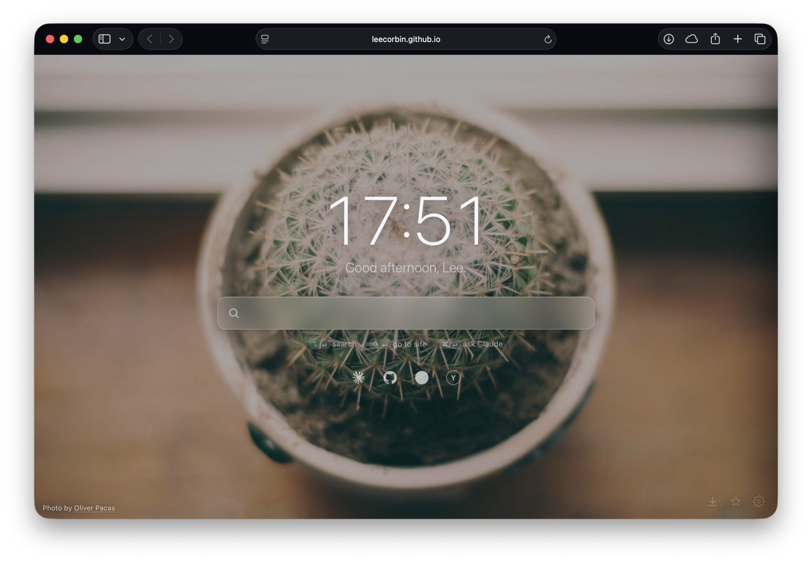

# start-page

A minimal, **instant** browser start page — a single `index.html` core (plus
optional lazy-loaded plugins) with no build step, no tracking, and no API keys.
Host it anywhere or just open it locally.
Inspired by [Bonjourr](https://bonjourr.fr), trimmed down and made hackable.

## Features

- ⚡️ **Instant load** — one self-contained file. A gradient paints immediately;
  the chosen photo fades in (or pops in instantly when prefetched/cached).
- 🔎 **Search / address box** — one field that works out what you typed:
  - `↵` → **smart**: opens it as a site if it looks like a URL (`github.com`),
    otherwise **searches** (Ecosia by default). Detection only fires on real common
    TLDs, so dotted search terms like `node.js` aren't hijacked.
  - `/` prefix or `⇧↵` → force **go to site** (bare words get `.com`, e.g. `/github`)
  - `⌥↵` → force **search**
  - `⌘↵` → **Ask Claude** (opens the Claude desktop app with your text prefilled)
  - `⌘L` still focuses Safari's real address bar (full history/autocomplete).
  - Smart detection is toggleable in settings.
  - **Custom keyword searches** — type `imdb avatar` and the box flips to an
    IMDb-search chip (showing the site's icon); `↵` goes straight to results.
    Presets included (IMDb, Rotten Tomatoes, YouTube, Wikipedia, GitHub, Amazon,
    Maps) and fully editable.
  - **Pick your engine** — Ecosia (default), DuckDuckGo, Google, Brave, Startpage,
    Qwant, Bing.
  - **Web suggestions** (off by default) — opt-in Google autocomplete with arrow-key
    selection; clearly labelled "sends typing to Google", since no privacy engine
    exposes suggestions to a static page.
  - **Site autocomplete** — sites you open via the box are remembered *locally*
    and inline-completed next time. Domain-first while you type the host
    (`cloz…`→`clozesure.com`); then **`Tab` / `/`** steps through the path one
    slash at a time, offering your most-used path at each level. `Return` to go,
    `Esc` to clear, **`⇧⌫`** to forget the current site/URL. After a few characters
    a dropdown also lists your *other* matching sites (`↓` to pick) — merged with
    web suggestions when those are on. Private to your browser; toggle it, or wipe
    it all, in settings.
- 🖼️ **Backgrounds** from keyless providers, with photographer credit:
  - **Photos** — fresh wallpapers from [Lorem Picsum](https://picsum.photos) (no API
    key, images from Unsplash), blended with your ⭐ favourites by a single
    **"Show new images"** slider — *Never · Rarely · Sometimes · Often · Always*.
    Set it to *Rarely* and you mostly see your own favourites, with the occasional
    newcomer to consider keeping. (Unlocks once you've favourited 5.)
  - **Per-favourite look** — favourite a photo and a **customise** button appears
    beside the ⭐: blur, brightness and tint are saved *with that favourite*, so it
    always reappears looking just-so. An **eyedropper** lets you pull a tint colour
    straight out of the photo. New and un-tuned images use an adjustable
    **default look**.
  - **Local folder** — drop your own wallpapers in `backgrounds/`. This source
    only appears when a `backgrounds/` folder is actually present (you're on
    `file://`, you've already configured it, or the folder announces itself with
    a `backgrounds/manifest.json` listing the images — which also auto-fills the
    file list), so a typical hosted copy stays uncluttered.
  - **Solid colour**
  - ⬇ **Download** the current photo to keep it locally.
- 🌤️ **Local weather** — keyless via [Open-Meteo](https://open-meteo.com); set a city
  or use your location. Understated icon + temperature.
- 🔗 **Quick links & custom searches** share the same icons: clean brand glyphs
  via [Iconify Simple Icons](https://simpleicons.org), falling back to the
  DuckDuckGo favicon then a letter monogram, with an optional per-item
  **emoji/symbol override** (⌃⌘Space). Quick links also have styled **hover
  tooltips**, **reorderable** rows, and a **Small / Medium / Large** icon-size
  option (handy for wide wordmark logos).
- 💾 **Export / import settings** — back up your whole config (and favourites) to a
  JSON file and restore it on another machine.
- 🌗 **Dynamic contrast** — samples the background's brightness and flips text/icons
  to stay legible on light *or* dark photos.
- 🕰️ **Digital or analogue clock** (analogue has a second hand) + time-of-day
  greeting (12/24h, optional seconds).
- ⚡️ **Instant images** — the *next* photo is prefetched during idle, so opening a
  new tab paints a fresh photo with no wait (after the first load).
- ⭐ **Frequent sites** — an optional second row that auto-surfaces the sites you
  visit most (above a min-visits threshold, excluding ones you've already pinned),
  with the same brand icons; hover an icon and tap × to forget it.
- 🧩 **Plugins row** — an optional row of one-click launchers for your installed
  plugins (calculator, colour…). Each of the three icon rows (quick links, frequent,
  plugins) has its own **Off / Small / Medium / Large** control in Settings.
- 🧩 **Plugins** — the omnibox can slide open into lazy-loaded mini-apps. Type a
  trigger and the box expands (spinner while the module fetches, fades in when
  ready); the plugin's own hints replace the standard ones, and `esc` always
  returns to the normal omnibox — or **click the plugin chip** (it shows a `×`)
  to leave without the keyboard; if the plugins row is shown, its launcher lights
  up and a second click closes it. `⌘/` inside a plugin opens **its own help page**,
  and each plugin can be toggled on/off in Settings → Shortcuts. Plugins live in
  `plugins/*.js` and are only downloaded on first use, so the core page stays
  instant. **Plugins load via dynamic `import()`, which browsers block from
  `file://`** — so plugins only work when the page is *hosted* (the rest of the
  page still works fine locally). When you deploy, ship the `plugins/` folder
  alongside `index.html`.
  - 🧮 **Calculator** (`==`) — a safe, no-`eval` expression engine with **exact
    fractions** (`1/3 + 1/6` → ½ = 0.5), pretty-rendered maths (stacked
    fractions, superscript exponents, radical signs), `%`/`of`, factorials,
    trig/log (radians), constants `π`/`e`, an `ans` variable, **hex/binary/octal**
    (`0xFF + 1`, with a click-to-copy bases readout on whole-number results), and a
    tape — click any entry to copy its result. Set **variables** (`x = 5`, `rate = 0.05`)
    and use them in later expressions; type **`y = x^2 − 3`** (or any expression
    with an unset `x`) and the panel grows into a **live graph** — gridlines and
    axes, asymptote-aware, zoomable via the +/− buttons, scroll, or trackpad pinch.
  - 🎨 **Colour** (`##`) — a keyless colour studio. Type a hex, `rgb()`, `hsl()`,
    `oklch()` or a CSS name — or grab one straight from the wallpaper with the
    **omnibox eyedropper** — and get every format, the nearest named colour,
    **WCAG contrast** on white &amp; black with AA/AAA and the best text colour,
    **harmonies** (complementary / analogous / triadic / tetradic), a tint-and-shade
    ramp, and a **colour-blindness** preview. **Click any swatch to make it the main
    colour** and travel the palettes; a back arrow retraces your steps, and a Copy
    button grabs the one you settled on. Two colours (`#5b9bff #ff5b9b`) draw a
    **gradient** with copyable CSS. **Save** colours with a name (☆) to build a
    personal **brand palette** — type a saved name (e.g. `coral`) or click its
    swatch to pull it straight back up. All offline maths.
  - 🛠️ **Dev tools** (`;;`) — keyless developer utilities that route from what you
    type: number **bases + bitwise** (`0xF0 & 0x0F`, `1 << 8`) with an interactive
    **bit grid** you click to toggle, **UUID v4** (`uuid 5`), **Unix timestamps**
    (`ts 1718000000`, `now`), **Base64** and **URL** encode/decode (`b64 …`, `url …`),
    and **SHA-1/256** hashes — all click-to-copy.
  - 🔤 **Text** (`,,`) — paste or type text and get every **case** (UPPER, lower,
    Title, Sentence, camelCase, PascalCase, snake_case, kebab-case, CONSTANT_CASE),
    a **slug**, reverse, trimmed, and **counts** (chars/words/lines/bytes) — each
    click-to-copy. The clear `×` resets it for the next snippet.
  - 📖 **Dictionary** (`??`) — type a word for **definitions** + IPA + a **▶ play**
    pronunciation, a **thesaurus** (synonyms / antonyms / related), and a
    **Wikipedia** excerpt with image — all keyless (dictionaryapi.dev, Datamuse,
    Wikipedia REST). **Click any word to look it up** and `←` to retrace, like the
    colour lab; **click the Wikipedia image** to enlarge it in the box. A ⚙ panel
    toggles **Wikipedia** (on) and **Urban Dictionary** slang (off by default).
    Debounced and cached.
  - 🖼️ **Images** (`::`) — keyless **image search** over freely-licensed sources:
    **Openverse** (Creative-Commons, aggregated from Flickr, museums and more) or
    **Wikimedia Commons**. Results come back as a thumbnail grid; click one to
    open a **lightbox** — the image large with **creator + licence attribution**
    and a link to the source. `←`/`→` browse the set, `esc` closes the viewer.
    Mature content is filtered; please honour each licence and credit the creator.
- ❓ **Help popup** (`⌘/`) — a low-key summary of what's here and the full keyboard
  shortcut list, including your custom searches.
- ⚙️ **Settings panel** (gear, bottom-right): background source, change frequency
  (every tab / hourly / daily / never), the new-images mix, default & per-favourite
  image look, weather, quick links, and more. Settings persist in `localStorage`.

## Use it as your browser start page

It's a single static file, so you have two options:

- **Host it (recommended).** Put `index.html` (and the `plugins/` folder) on any
  static host — your own domain, GitHub Pages, Netlify, etc. — then set it as your browser's homepage and
  new-tab page. A real `https` origin gives you three things a local file can't:
  the search box can **auto-focus on new tabs/windows**, `localStorage` is
  rock-solid, and the address bar shows a clean URL.
- **Open it locally.** Point your homepage at `file:///path/to/index.html` — zero
  setup, but **plugins (e.g. the calculator) won't load from `file://`**, and see
  the focus note below.

In Safari: **Settings → General → Homepage**, then set **New windows** and
**New tabs** to open with **Homepage**. Turn on **Focus box on load** in the
settings panel to land your cursor in the search box.

### About cursor focus

One Safari quirk: when opened from a **local `file://`**, Safari insists on
focusing its *own* address bar for new tabs and a page can't override it — so
"Focus box on load" appears to do nothing there. Served from a real **`http(s)`
origin it works as expected.** (Either way, `⌘L` always focuses Safari's address
bar, with full history/autocomplete.)

## Compliance / data

- No analytics, no cookies, no accounts. Settings stay in your browser.
- Backgrounds use only **keyless** providers, within their intended use:
  - Picsum images come from Unsplash; we display the photographer credit with a
    referral link.
  - We deliberately **do not** embed an Unsplash/Pexels API key or proxy through
    anyone else's backend — that would breach those APIs' terms.
- Local-folder mode is fully offline.
- Ships with `<meta name="robots" content="noindex, nofollow">` so a hosted copy
  stays out of search results — remove it if you want it indexed.

## License

[MIT](LICENSE).
